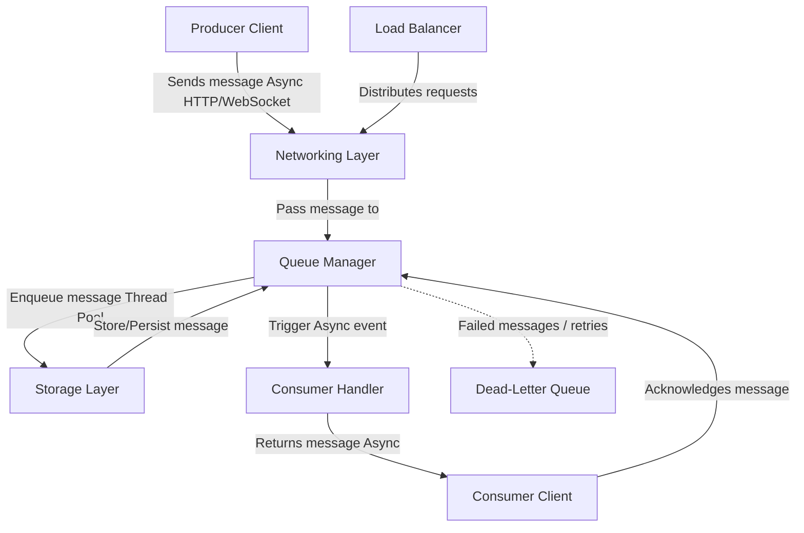

```mermaid
graph TD
    A[Producer Client] -->|Sends message Async HTTP/WebSocket| B[Networking Layer]
    B -->|Pass message to| C[Queue Manager]
    C -->|Enqueue message Thread Pool| D[Storage Layer]
    D -->|Store/Persist message| C
    C -->|Trigger Async event| E[Consumer Handler]
    E -->|Returns message Async| F[Consumer Client]
    F -->|Acknowledges message| C
    C -.->|Failed messages / retries| G[Dead-Letter Queue]
    LB[Load Balancer] -->|Distributes requests| B
```
