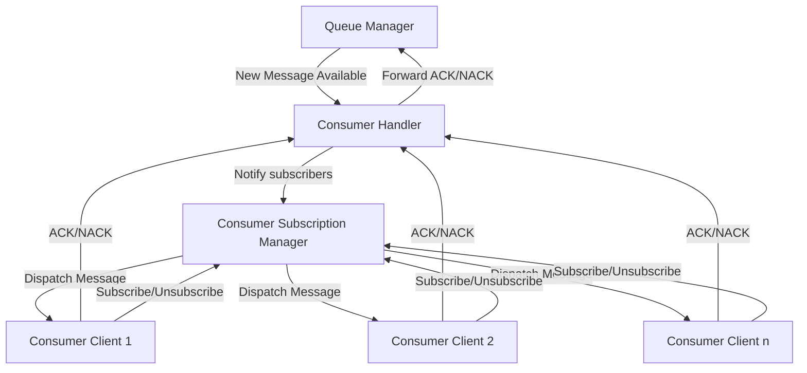

```mermaid
graph TD
    QM[Queue Manager] -->|New Message Available| CH[Consumer Handler]
    CH -->|Notify subscribers| CSM[Consumer Subscription Manager]
    CSM -->|Dispatch Message| CC1[Consumer Client 1]
    CSM -->|Dispatch Message| CC2[Consumer Client 2]
    CSM -->|Dispatch Message| CCn[Consumer Client n]
    
    %% Acknowledgment flow
    CC1 -->|ACK/NACK| CH
    CC2 -->|ACK/NACK| CH
    CCn -->|ACK/NACK| CH
    CH -->|Forward ACK/NACK| QM

    %% Subscription registration
    CC1 -->|Subscribe/Unsubscribe| CSM
    CC2 -->|Subscribe/Unsubscribe| CSM
    CCn -->|Subscribe/Unsubscribe| CSM
```
