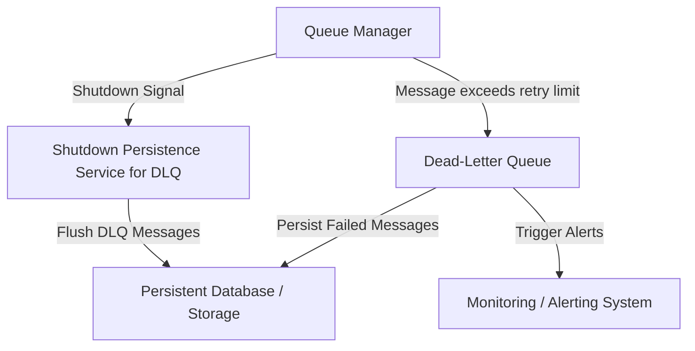

```mermaid
graph TD
    QM[Queue Manager] -->|Message exceeds retry limit| DLQ[Dead-Letter Queue]
    DLQ -->|Persist Failed Messages| PDB[Persistent Database / Storage]
    DLQ -->|Trigger Alerts| MON[Monitoring / Alerting System]

    %% Shutdown Integration for DLQ
    QM -->|Shutdown Signal| SS_DLQ[Shutdown Persistence Service for DLQ]
    SS_DLQ -->|Flush DLQ Messages| PDB
```
