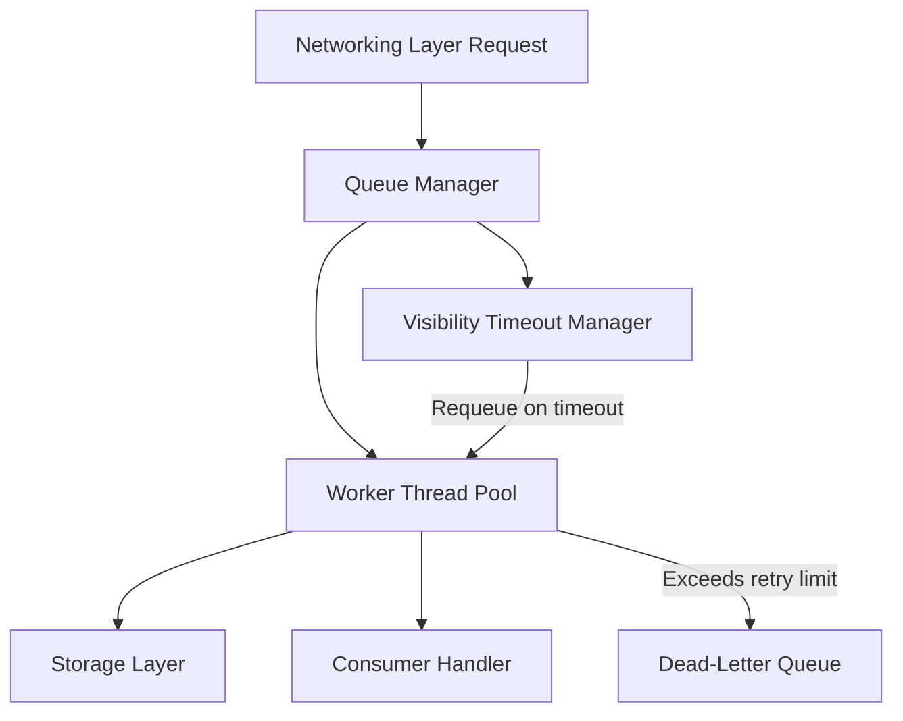

```mermaid
graph TD
    NL[Networking Layer Request]
    QM[Queue Manager]
    WP[Worker Thread Pool]
    SL[Storage Layer]
    CH[Consumer Handler]
    VTM[Visibility Timeout Manager]
    DLQ[Dead-Letter Queue]

    NL --> QM
    QM --> WP
    WP --> SL
    WP --> CH
    QM --> VTM
    VTM -- "Requeue on timeout" --> WP
    WP -- "Exceeds retry limit" --> DLQ
```
