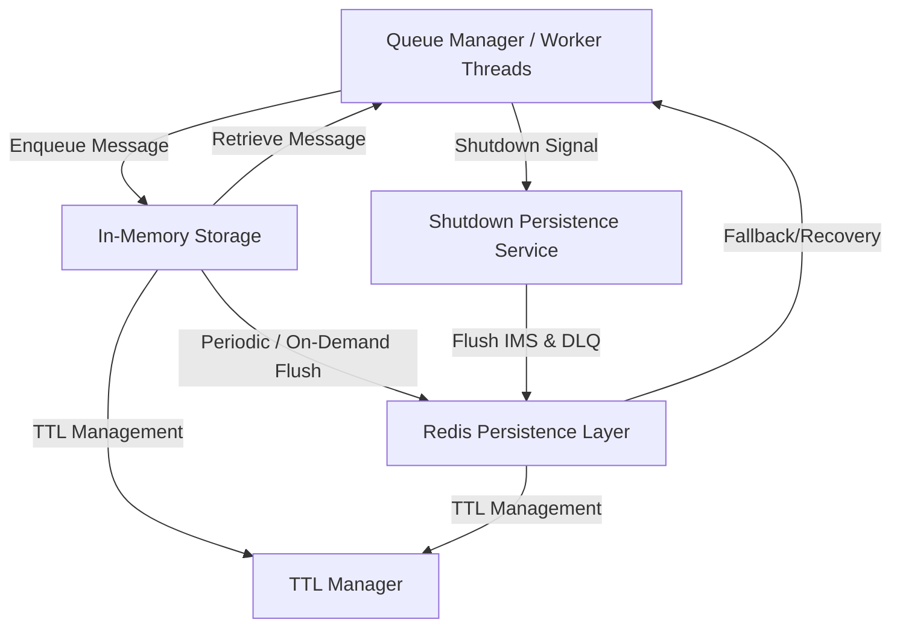

```mermaid
graph TD
    QM[Queue Manager / Worker Threads] -->|Enqueue Message| IMS[In-Memory Storage]
    IMS -->|Periodic / On-Demand Flush| RED[Redis Persistence Layer]
    IMS -->|Retrieve Message| QM
    RED -->|Fallback/Recovery| QM
    IMS -->|TTL Management| TTL[TTL Manager]
    RED -->|TTL Management| TTL

    %% Shutdown Integration
    QM -->|Shutdown Signal| SS[Shutdown Persistence Service]
    SS -->|Flush IMS & DLQ| RED
```
