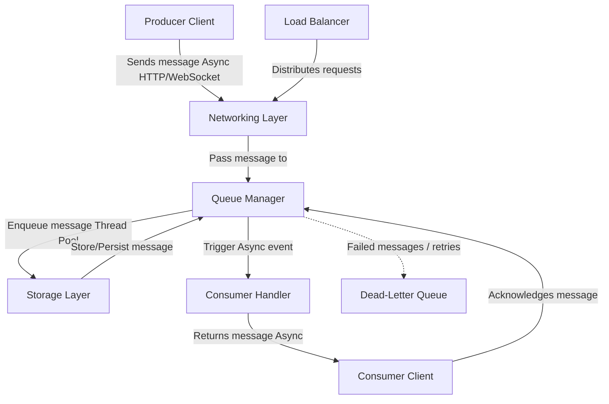
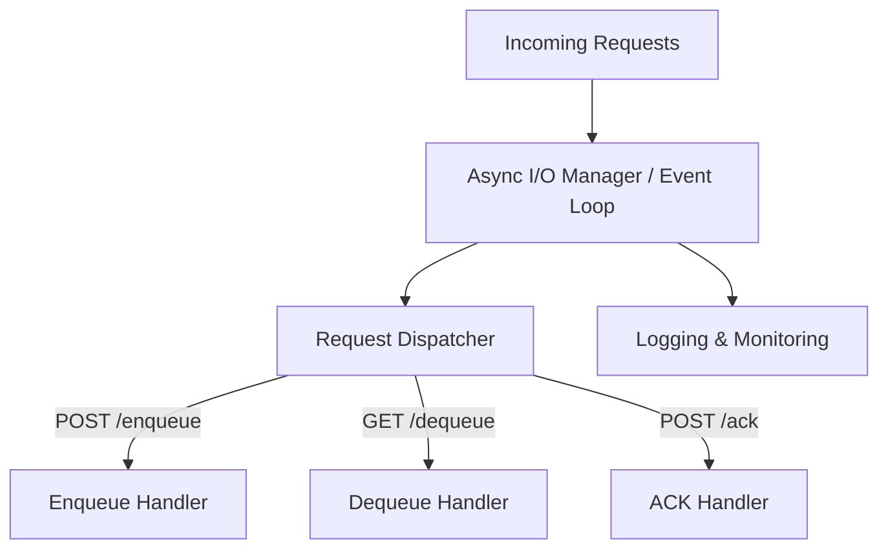
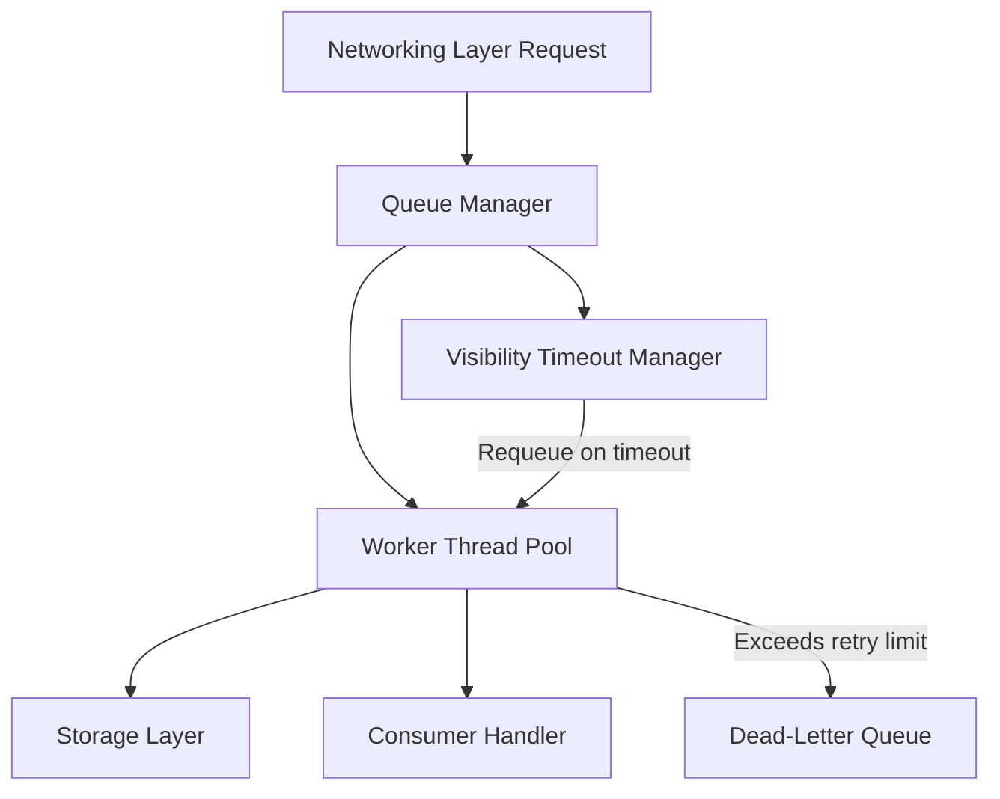
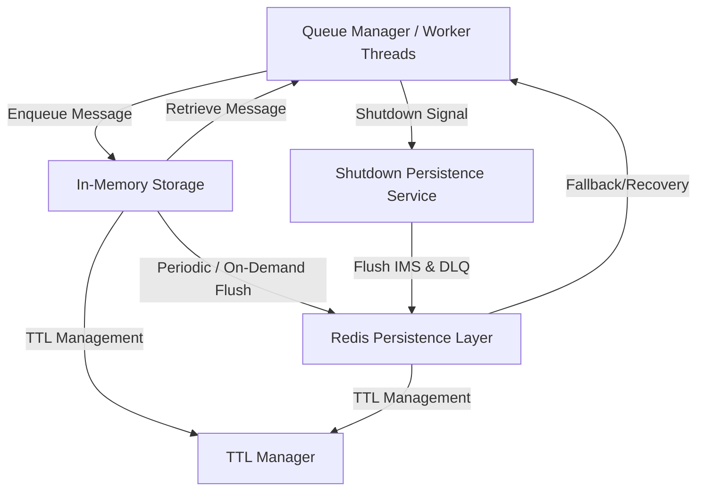
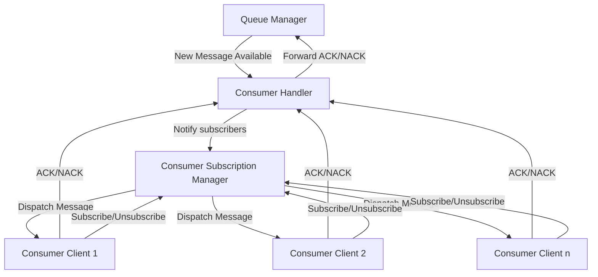
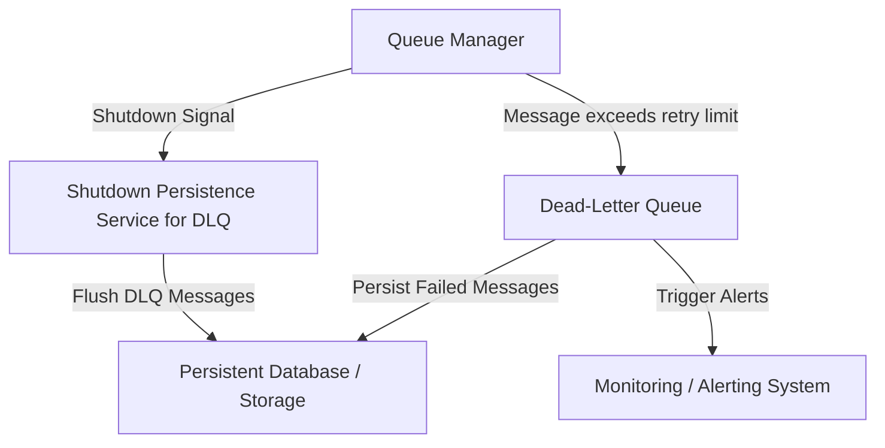

# Architecture

## High-Level Architecture Overview

This project is a custom-built **SQS-like message queuing system** designed using C++ to explore **multithreading**, **asynchronous networking**, and **durable message handling**.

The system is composed of modular services that work together to enable reliable, scalable message delivery between producers and consumers, while also handling failure scenarios gracefully.

### Core Features

- **Asynchronous Networking Layer**  
  Handles concurrent client connections (HTTP/WebSocket) using event-driven programming for high throughput and low latency.

- **Queue Manager with Multithreaded Processing**  
  Central coordinator using a thread pool to manage message lifecycle: enqueue, delivery, visibility timeout, retries, and dead-letter handling.

- **Hybrid Storage Layer**  
  Combines fast **in-memory storage** for real-time performance with **Redis** for durability, TTL management, and safe shutdown persistence.

- **Consumer Handler & Subscription Manager**  
  Delivers messages to consumers via async events. Supports dynamic consumer registration and message acknowledgment logic (ACK/NACK).

- **Dead-Letter Queue (DLQ)**  
  Stores messages that fail repeatedly for later inspection, alerting, and optional replay.

- **Graceful Shutdown Support**  
  Persists in-memory messages and DLQ contents to Redis on shutdown to prevent message loss.

- **Optional Components**  
  Load balancer, monitoring/logging system, and security/auth (planned as future enhancements).

### Architecture Goals

- Learn and apply multithreading and asynchronous programming patterns in C++.
- Design a production-grade system architecture with resilience and modularity.
- Build a foundation for extensibility (rate limiting, metrics, replay tools, etc).

### Architecture Diagram

# Networking Layer

## Diagram

## Overview

- Incoming Requests:
    - Clients (producers and consumers) send HTTP/WebSocket requests to your server.
- Async I/O Manager/Event Loop:
    - Uses non-blocking I/O (via libraries like Boost.Asio) to manage multiple concurrent connections.
- Request Dispatcher:
    - Routes requests based on their type/endpoint (i.e., enqueue, dequeue, or acknowledge).
- Enqueue/Dequeue/ACK Handlers:
    - Dedicated handlers that process the specific request and hand off the data to/from the Queue Manager.
- Logging & Monitoring:
    - Captures runtime metrics and logs for debugging and performance tracking

# Queue Service

## Diagram

## Overview

- Networking Layer Request (NL):
    - Represents incoming requests from the Networking Layer (e.g., for enqueuing or dequeuing messages).
- Queue Manager (QM):
    - Orchestrates overall message flow. It receives requests from the Networking Layer and delegates processing tasks.
- Worker Thread Pool (WP):
    - Handles processing tasks concurrently, such as adding messages to or retrieving messages from the Storage Layer.
- Storage Layer (SL):
    - Handles message persistence, either via in-memory structures or a hybrid solution (e.g., Redis).
- Consumer Handler (CH):
    - Manages outgoing responses to consumers (delivering messages, handling ACKs) via asynchronous mechanisms.
- Visibility Timeout Manager (VTM):
    - Monitors message acknowledgment timing. If a message is not acknowledged in time, it instructs the Queue Manager to requeue it for redelivery.
- Dead-Letter Queue (DLQ):
    - For messages that have exceeded the retry threshold or fail persistently, they are moved to the DLQ for further inspection and debugging.

# Storage Layer

## Diagram

## Overview

- Queue Manager / Worker Threads (QM):
    - Directly interacts with the In-Memory Storage. It also communicates with the Shutdown Persistence Service when a shutdown event is detected.
- In-Memory Storage (IMS):
    - Acts as the fast, primary storage for incoming messages. It provides ultra-low latency access.
- Redis Persistence Layer (RED):
    - Functions as a persistent backup for the in-memory store.
    - Messages are periodically flushed or stored on-demand in Redis.
    - Also serves as a fallback for message recovery in case the in-memory store is cleared or encounters issues.
- TTL Manager (TTL):
    - Manages expiration for messages in both the in-memory storage and in Redis.
    - Ensures messages are cleaned up from both storage layers once their TTL expires, maintaining resource efficiency and meeting retention policies.
- Shutdown Persistence Service (SS):
    - Acts upon receiving a shutdown signal from the Queue Manager.
    - Initiates the final flush of all pending messages in IMS (and also DLQ messages if applicable) to RED so that all in-flight messages are safely persisted.

# Consumer Handler

## Diagram

## Overview

- Queue Manager (QM):
    - When a new message is ready for delivery, the Queue Manager signals the Consumer Handler asynchronously.
- Consumer Handler (CH):
    - Acts as the hub for consumer communications. It receives a signal from the QM whenever a new message is available.
    - Forwards this event to the Consumer Subscription Manager to notify all registered consumers.
    - Receives acknowledgments (ACK) or rejections (NACK) from consumers and reports back to the QM to finalize message processing (e.g., removal or re-queuing).
- Consumer Subscription Manager (CSM):
    - Registration & Deregistration:
        - Allows Consumer Clients to subscribe (register) or unsubscribe (deregister) from receiving notifications.
        - Maintains an up-to-date list of active consumers interested in processing messages.
    - Notification:
        - When informed by the Consumer Handler of a new message, the CSM notifies all registered clients by dispatching the message.
        - Optionally, it can implement strategies for load balancing the message if all consumers are not meant to process the same message (e.g., using a round-robin or a publish/subscribe mechanism).
    - Monitoring:
        - Optionally, integrates with a Consumer Activity Monitor to check the health and responsiveness of each consumer, facilitating dynamic subscription updates.
- Consumer Client (CC):
    - These are the endpoints (or instances) that subscribe to receive messages.
    - They send an ACK (or NACK) back through the Consumer Handler once a message has been processed.
    - They initiate subscription requests to the CSM upon connection and can disconnect or unsubscribe as necessary.
    - Receives messages asynchronously from the Consumer Handler.
    - Sends back an ACK (or NACK) depending on whether the message was processed successfully.
- Consumer Subscription Manager (SUB) (Optional):
    - Manages the registrations for consumers that subscribe for message notifications, aiding in the Observer Pattern implementation.

# Dead-Letter Queue

## Diagram

## Overview

- Queue Manager (QM):
    - This component monitors message processing. When a message repeatedly fails to be acknowledged or processed (exceeding a retry threshold), it is forwarded to the Dead-Letter Queue.
    - Signals a shutdown to the DLQ-specific shutdown service.
- Dead-Letter Queue (DLQ):
    - The DLQ acts as a holding area for failed messages that could not be processed successfully.
    - This isolation allows the rest of the system to continue operating without being blocked by problematic messages.
    - When a shutdown occurs, its contents are flushed to the persistent database.
- Persistent Database / Storage (PDB):
    - Messages in the DLQ can be persisted in a separate durable storage.
- Monitoring / Alerting System (MON):
    - Integrating a monitoring solution ensures that operations teams are alerted when messages are being sent to the DLQ.
    - This makes it easier to identify systemic issues or bugs in message processing.
    - Continues to track DLQ activity and issue alerts when needed.
